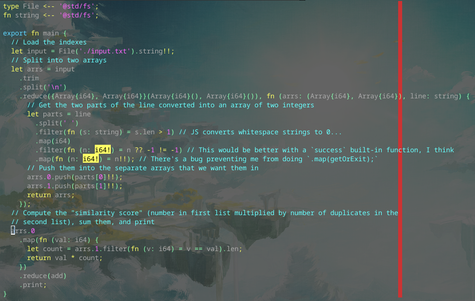

# Day 1 Part 2

## Implemented with [this Alan commit](https://github.com/alantech/alan/commit/e17a201a9a261780a36143b174c14310db837308)

## Required PRs

No extra PRs required beyond Day 1 Part 1.

## Build and run commands

* Native: `alan test source.ln`
* Javascript: `alan test --js source.ln`

## Thoughts

This one was less awkward than the prior part. The first 2/3rds of the program is identical, while the final map function is simpler with its own inner array operation (a `filter` using the closure value followed by a `len` check).
