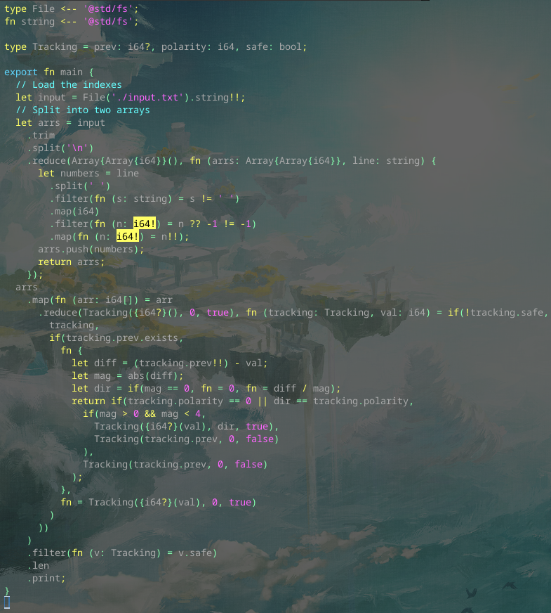
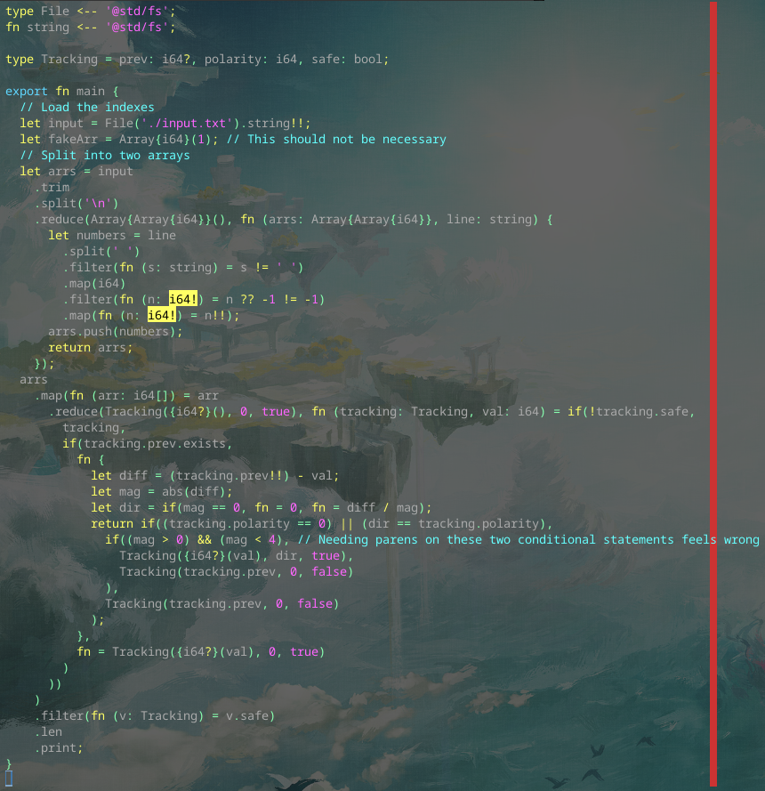

# Day 2 Part 1

## Implemented with [this Alan commit](https://github.com/alantech/alan/commit/6b6eb7a6943095dea58536ae88e59721e87c8020)

## Required PRs

1. [Resolve generic types in a generic function call correctly](https://github.com/alantech/alan/pull/989) - Trying to call a generic type constructor function where the inner generic type is itself a generic type *that has not yet been created in scope* would fail without this. I was able to work around it by creating a useless variable with the inner type, but that's horrible, so I refused to submit the problem with that workaround and figured out how to fix it. This is what took up most of the day.
2. [Make operator precedence more C-like](https://github.com/alantech/alan/pull/990) - I needed to put parens in surprising places, so I realized my operator precedence was messed up. I looked up the C operator precedence for input on what I should change and then I was able to remove the parens and have the comparison and boolean operators mix as expected.

## Build and run commands

* Native: `alan test source.ln`
* Javascript: `alan test --js source.ln`

## Thoughts

I encountered a pretty serious bug with this one. I knew when I wrote the `TODO` on the original code that it was going to have a place where it would fail on me, but I hadn't realized something as simple as `Array{Array{i64}}()` would be enough to trigger it.

I also ran into unexpected operator precedence issues. I thought after so many tests things like that would've already been covered, but my tests are generally very low in cyclomatic complexity, and I hadn't included a mix of equality and boolean operators before. The fix for that was *very* trivial, since operator precedence is just declared in Alan's root scope and I just needed to adjust the numbers. The only difficulty was mentally keeping track of the precedence, since I use "larger precedence number wins" but a lot of online precedence tables have "lowest precedence number wins" I'm guessing in a sort of "first place, second place, etc" kind of listing.

Now, these were not blockers to getting the right answer, but I had to create an unused variable to work around the first issue and add seemingly-unnecessary parens to the comparisons. The code, below, just didn't *feel* right.

