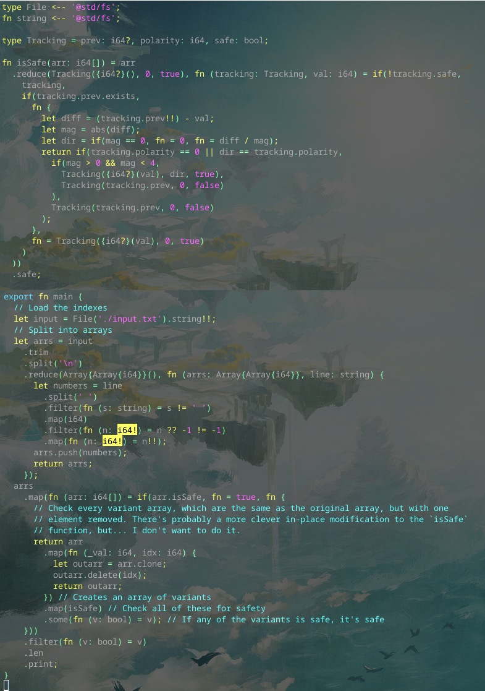

# Day 2 Part 2

## Implemented with [this Alan commit](https://github.com/alantech/alan/commit/6b6eb7a6943095dea58536ae88e59721e87c8020)

## Required PRs

No extra PRs required beyond Day 2 Part 1.

## Build and run commands

* Native: `alan test source.ln`
* Javascript: `alan test --js source.ln`

## Thoughts

I couldn't get away with everything being inline in the `main` function and needed to add a new function to do this one. I *probably* could've come up with a solution that in-line checked if the solution could be found in a different way, but I decided to just have a secondary exhaustive check of the possibilities if the first pass was marked as a failure, since I could reuse a lot of code and didn't need to modify the safety algorithm much at all.

The type safety did help me here. At first my generation of sub-arrays was written as `arr.clone.delete(idx)` and I couldn't figure out why that wasn't compiling, until I realized that the next `map` call was complaining about arguments of `i64[], i64[] -> bool` and I realized that it wasn't `Array{Array{i64}}, i64[] -> bool` as I was expecting.

(Side note, I may want to add operators `[][]` as an alias to `Array{Array{T}}`, `[][][]`, etc, but not sure how many nestings deep I should allow. Beyond 4 seems silly, but...)

I did run into one unexpected piece, I tried to define `fn self{T}(v: T) = v` and then use it in the `.some` and `.filter` calls, but it was not able to resolve the generic type. I need to dig into that, but I didn't want to block on it here: I'm also not sure if that would've been *legible* to readers of the code to have `.some(self)` or `.filter(self)` so I chose the explicit identify functions anyways.
