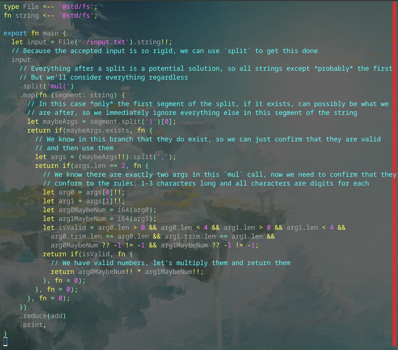

# Day 3 Part 1

## Implemented with [this Alan commit](https://github.com/alantech/alan/commit/fe3d01fb172ecb18cfd334dda5a88f70f6568926)

## Required PRs

1. [More precedence tweaking](https://github.com/alantech/alan/pull/991) - I unexpectedly needed to write `(foo!!) * (bar!!)` instead of just `foo!! * bar!!`. This fixes that.

## Build and run commands

* Native: `alan test source.ln`
* Javascript: `alan test --js source.ln`

## Thoughts

I heard a lot of people used regexes for this one, and a few people used proper tokenization, so I feared I was going to need to either add regexes to Alan (as a standard library, not root scope built-in) or write my own first actual library for Alan binding `nom` for Rust (and I don't know what for JS) to do this, and that I would fall far behind on Advent of Code doing all of this foundational work.

But when I looked at the problem closely, I realized that it's not a great fit for a tokenizer because of all of the garbage in the data, so regex would probably be better, but then I also realized that the rigidity of what is being parsed out made it amenable to "inverse tokenizing" with simple `split` calls, so that's what I ended up doing.

I think it turned out pretty readable, but I was more diligent in adding comments here, as why I'm doing what I'm doing may be non-obvious.
