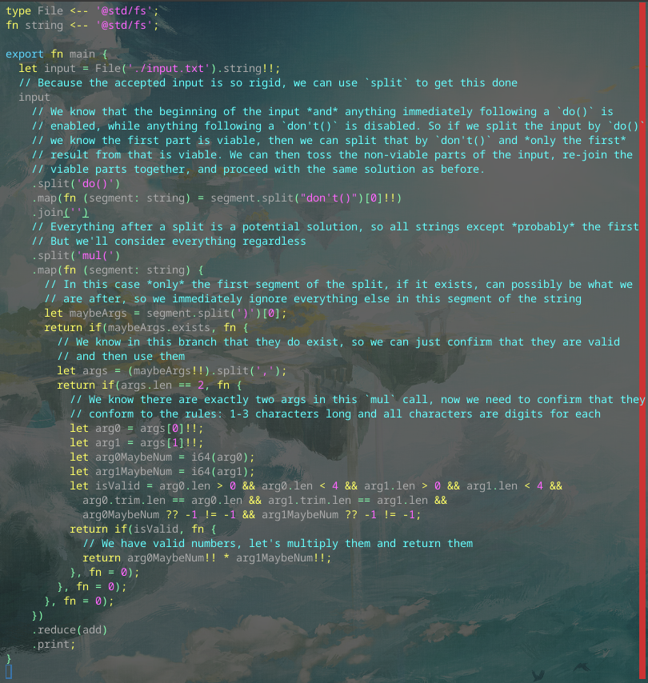

# Day 3 Part 2

## Implemented with [this Alan commit](https://github.com/alantech/alan/commit/fe3d01fb172ecb18cfd334dda5a88f70f6568926)

## Required PRs

No extra PRs required beyond Day 3 Part 1.

## Build and run commands

* Native: `alan test source.ln`
* Javascript: `alan test --js source.ln`

## Thoughts

The `do()` and `don't()` commands simply marked follow-up characters as effectively a comment or not, so I realized that splitting fist by `do()` guarantees the beginning of each string segment is not a comment, and then splitting by `don't()` on each segment determines what part of the segment is considered a comment (everything after the first `don't()` so I discarded it, then rejoined the string to only include the non-comment pieces and used the same code from Part 1.

I could have probably not re-joined the string and instead operated on each valid segment and then summed the sums as a performance optimization, but my goal is finding compiler bugs, missing features, and, in my own opinion, "ugly" code I am forced to write and how to avoid that, not getting to the top of any leaderboard, so I'm fine with the simpler mutation for Part 2 here.
