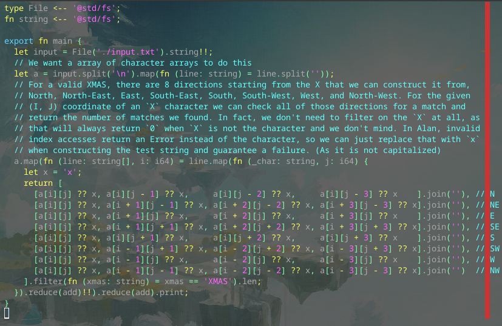

# Day 4 Part 1

## Implemented with [this Alan commit](https://github.com/alantech/alan/commit/f3720868b6251e7293352aae164217a6965e570c)

## Required PRs

1. [Allow chaining of nullable `get` calls and fix a bug in JS codegen for optional arrays](https://github.com/alantech/alan/pull/992) - While implementing this problem, two things came up. `a[i][j]` was not valid, and needed to be written `(a[i] ?? [])[j]`, which is awful, so I fixed that. And then when I ran the problem through the JS path it failed to compile due to missing branches in the JS codegen path, so I fixed that, as well.

## Build and run commands

* Native: `alan test source.ln`
* Javascript: `alan test --js source.ln`

## Thoughts

I feel like Alan's array accesses returning a Maybe type was vindicated, as rather than needing to write more complex conditional code to avoid out-of-bounds indexes to prevent a `panic` (in Rust) or invalid data (in Javascript), I could just unwrap the invalid data with a replacement character and continue on, making my code pretty simple, mostly being `map`s and `reduce`s.

I ran into an issue where `a[i][j-1]` didn't parse properly, and I needed to pad that with spaces, because it was being interpreted as `j` and `negative one`, not `j minus one`. This technically only affected the subtractions, and I could have kept `j+1` as-is, but I decided to keep the spacing for reasons of clarity. I don't think this is really a "bug", or at least, it's a "bug" that is common across popular programming languages, so I'm not going to fix it.

The compiler pointed out a few different bugs in my logic involving the `reduce` step -- at first I had just one `reduce` but then I realized I needed one per line and one to sum the values found per line, and then I realized that it was requiring me to unwrap the reduce value with `!!` because *technically* the line could have zero characters and be empty, not allowing `add` to be called on anything.

The compiler errors weren't *great* (mostly because I don't have line and character numbers in the error messages yet) but since I was familiar with them I was able to quickly turn around on these mistakes, which was good.
