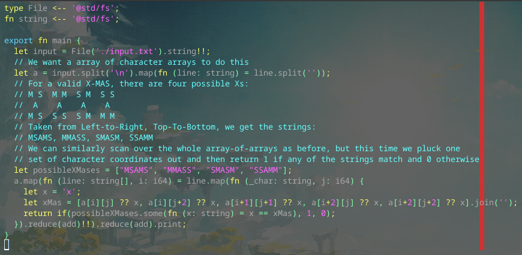

# Day 4 Part 2

## Implemented with [this Alan commit](https://github.com/alantech/alan/commit/f3720868b6251e7293352aae164217a6965e570c)

## Required PRs

No extra PRs required beyond Day 3 Part 1.

## Build and run commands

* Native: `alan test source.ln`
* Javascript: `alan test --js source.ln`

## Thoughts

This one was much simpler than the first, imo. Once the valid potential sets were determined I realized that the coordinates to read were the same for all of them so reversing the testing to compare the generated string versus the small set of valid strings would work better here, and therefore the number of LOC, even including the comments, is much smaller than Part 1.

And since the array offets were all positive, I also did `[j+2]` without spaces to demonstrate that it really was just a quirk of negative numbers colliding with the `sub` operator symbol. Maybe I could "fix" this by just saying "variable followed by a negative constant number? Turn that into a subtraction operation." I'm still not sure if I should, though, since that's not a feature users of the language could ever replicate themselves, but since I don't have a way for defining your own constant literals, maybe that doesn't matter?
