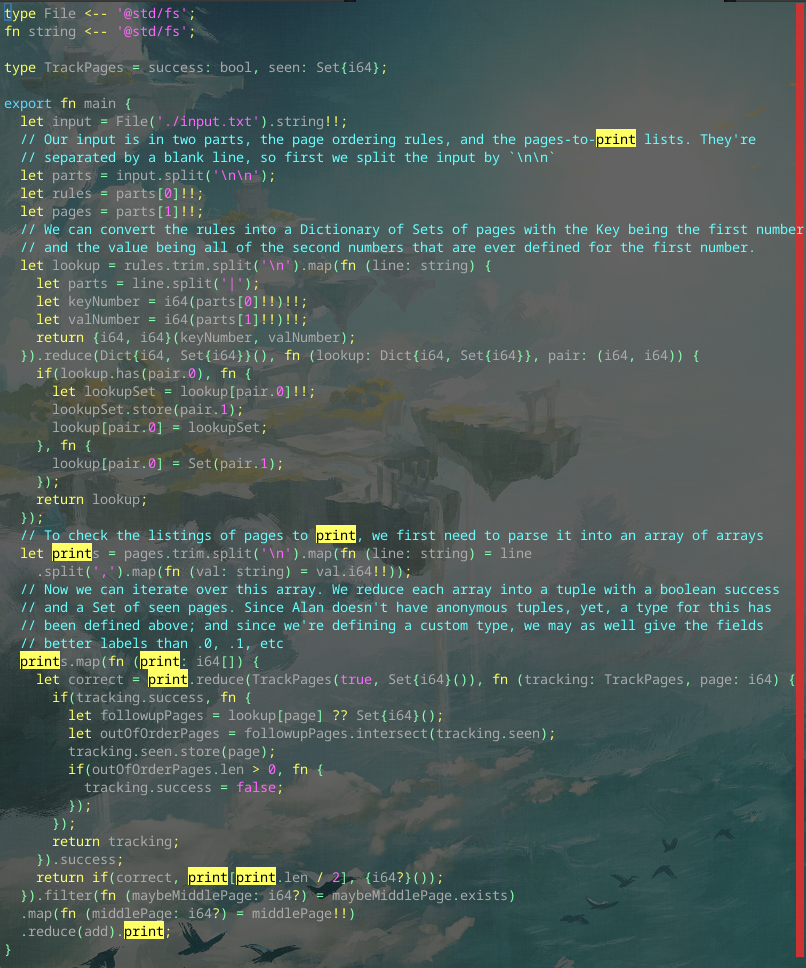

# Day 5 Part 1

## Implemented with [this Alan commit](https://github.com/alantech/alan/commit/bc1ff34564714398a49f9954e478ff8b18affbec)

## Required PRs

1. [Improved JS clone function that better handles nesting](https://github.com/alantech/alan/pull/993) - The first bug I ran into was that trying to `clone` a product type, so this fixed that.
2. [Remove test branch from the root scope](https://github.com/alantech/alan/pull/994) - Accidentally left the test branch from the prior PR in the code when it was merged, so this needed to be fixed.
3. [Fix generic type resolution when cloning structs](https://github.com/alantech/alan/pull/995) - Technically not necessary, but product types still needed to be explicitly added to the generic type list instead of automatically inferred to work. This was because the product type was being interpreted as separate arguments rather than just one.
4. [Add some hackery for conditionals where the functions are "block-like" side-effect-only functions for Rust](https://github.com/alantech/alan/pull/996) - if you tried to have both branches of a conditional mutate an outer scope variable, it would fail to compile in Rust because the implementation was technically passing a mutable reference to two different functions, which the borrow-checker disallows, so this hackery rewrites block-like side-effect-only functions in a conditional back into an if statement.

## Build and run commands

* Native: `alan test source.ln`
* Javascript: `alan test --js source.ln`

## Thoughts

I fell pretty far behind because of this one. The logic I got right quickly and working in JS the day-of, but getting it to work in Rust was just not working, and I won't submit anything until both branches are working.

I got caught up on the weird errors I ran into with the `clone`, though, and spent a lot of time figuring out why it wasn't working as expected, when this was not the biggest problem in the codebase. The JS issue was definitely a blocker since it was generating code that simply didn't work, but the compiler needing the struct to be passed in with its name instead of inferred was not as important. I am glad that I fixed it, but I'm not sure it was the best use of time.

The bigger issue was parent-scope mutation simply not working in conditionals because the generated Rust code was invalid. It was invalid because of the borrow-checker being too strict, (two closures getting a mutable reference to the same variable won't work only in a multi-threaded environment, in a single thread the mutation will be one-by-one and valid (and it does work in Javascript because of that) so for now I've added in a hack in the compiler to detect when a conditional is operating on only "block-like" side-effect-only functions and rewrite it back into an `if` statement that correctly understands that only one of the two mutations will actually occur. This fixes *most* situations this kind of thing would occur, but not all.