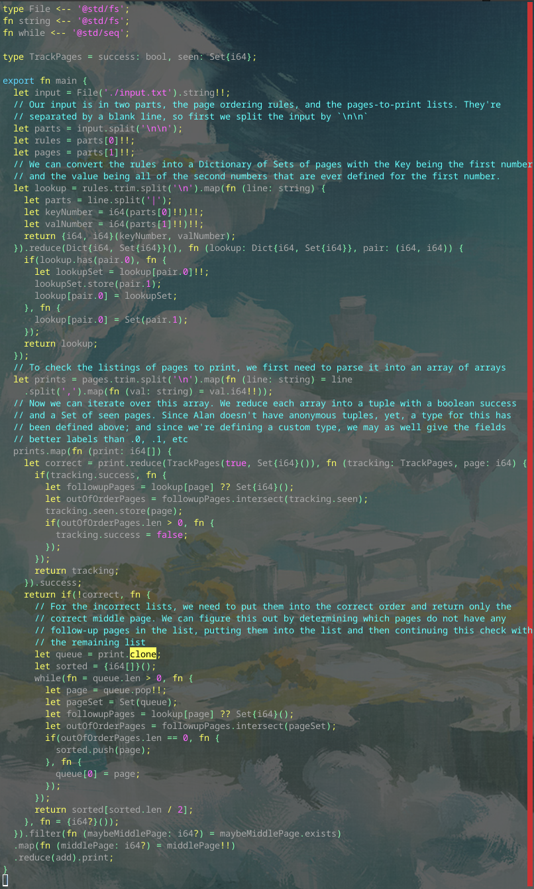

# Day 5 Part 2

## Implemented with [this Alan commit](https://github.com/alantech/alan/commit/7a5dd2d1242041c322917486371bbba94c9afba7)

## Required PRs

1. [Implement `@std/seq` `while`](https://github.com/alantech/alan/pull/997) - I could have use a fixed-length loop brute forcing all of the combinations of array ordering, but the best algorithm was a queue-based one which has an indeterminant number of loops, so I needed to implement the `while` function to do that.

## Build and run commands

* Native: `alan test source.ln`
* Javascript: `alan test --js source.ln`

## Thoughts

I got part 1 implemented late last night, so I waited until this morning to do part 2. Again I had a decision to make very similar to the decision for part 1: do I go with a crappier algorithm that requires no changes to Alan, or do I implement the feature I need in Alan to do the better algorithm?

In this case, I would say which algorithm is more "obvious" depends on your perspective, but for newer developers the crappier algorithm probably is, so it was harder to justify in my mind implementing the change to Alan, but in the end I decided that the feature should be implemented, even if I don't want it to be something you immediately reach for, so like with Alan 0.1, I've created an `@std/seq` and implemented the unbounded `while` loop as a function you can import from it.

The crappier, algorithm, btw, was simply iterating through all permutations of the list of pages and return the first one that passes the test. The enumeration of all permutations would be fixed in size, and then you just `find` the first permutation that passes the test. This was doable with the version of Alan used in the part 1 program, though without generators it would consume a lot of wasted memory constructing the permutations ahead of time only to throw most of them away.

The algorithm I went for, though, is based on a queue. You pull a value off of the queue, determine if it could reasonably be the last element in the output list relative to the rest still in the queue, and if so insert it into the output array, otherwise re-insert it to the *back* of the queue to test again later. Because of how I implemented array assignment in Alan, the clean option is to consider the last element of the array as the front of the queue and the first element of the array as the back of the queue, so you can just `.pop` the next element off, and then re-assign `queue[0]` to that value if it didn't work (and it will shift all of the values forward).

This approach requires far fewer comparisons and doesn't generate a bunch of "wasted" array permutations, but needs to simply loop on the `queue` until there are no values left in it, and how many times it will loop depends on the dependency graph stored in the page ordering dictionary, and cannot be determined ahead of time, hence a traditional `while` loop with a conditional exit.

The reason why I don't have `while` baked into the root scope like most languages, is because it is very easy to accidentally write an infinite loop, and it's impossible to parallelize, as the operations *depend explicitly* on the prior operations and the order they happened in, so I want at least a bit of friction before you reach for these traditional low-level tools that make it easy to produce bad code or code that doesn't scale.