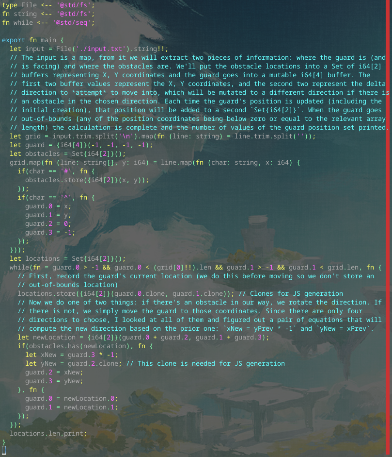

# Day 6 Part 1

## Implemented with [this Alan commit](https://github.com/alantech/alan/commit/7eced02d583993281eb46448487a9e633c0e7e22)

## Required PRs

1. [Fix direct offset access for buffers and make Set work as expected in Javascript](https://github.com/alantech/alan/pull/1000) - The `.0`, `.1`, etc methods on Buffers didn't exist. (I could've sworn I had implemented them, but no.) And `Set` didn't work right in Javascript. I got *a* fix for JS pretty quickly, but one that passed the full test suite took forever and basically required abandoning the built in `Set` type.

## Build and run commands

* Native: `alan test source.ln`
* Javascript: `alan test --js source.ln`

## Thoughts

Again the problem itself was much easier than the bugs I ran into in the compiler. Well, the missing `.0`, `.1`, etc accessor methods for Buffers was really easy to implement since it was mostly copy-pasting logic for unlabeled tuples, and getting the `Set` type to behave *for this test* was pretty easy, but then I spent *hours* (interrupted by real life, but still thinking about it in the back of my head) figuring out how to get it to work as expected when compiling to Javascript. In the end I decided that I needed full control over the behavior of it and created a `FuzzySet` class that implemented everything I needed, and then I spent more hours dealing with corner-cases brought about by the `GPUBuffer` type in the browser, which doesn't implement a `toString` function unlike the vast majority of built-in types and my own fatigue.

So much so that I'm not going to tackle Part 2 until tomorrow (today, it's past midnight here), but hopefully it follows the pattern of most other days and requires no new changes to the compiler.

At least I've got better comments in the source code this time around.
