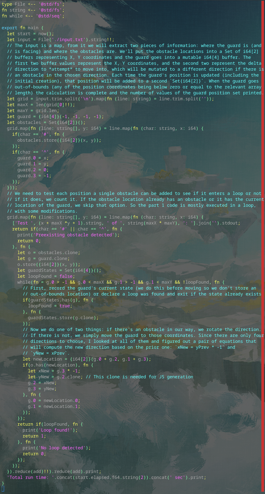

# Day 6 Part 5

## Implemented with [this Alan commit](https://github.com/alantech/alan/commit/e3d6d1660ac0505b0649d1dbf854083f07b5f2f8)

## Required PRs

1. [Make an empty string split create a char array in Rust](https://github.com/alantech/alan/pull/1001) - I noticed that the results of the JS and Rust paths differed slightly, and eventually figured out that there were two blank columns in the Rust result because `split('')` would produce an empty string at the beginning and end of the array. I switched this to using an explicit `chars` call and converting that into an array of strings to make this match Javascript (and my own expectations) but only for that particular case.
2. [Guarantee that map executes in order in JS](https://github.com/alantech/alan/pull/1002) - While figuring out the above, I realized that the execution order of the `map` call was not guaranteed, since it used `Promise.all` to convert the array of promises to values, instead of running one-at-a-time. This didn't affect the output, but it's still a problem for cases where mutation of an outer scope depends on execution order. This was not caught in earlier testing because very simple maps devolve back into non-async code and the `Promise.all` does nothing. I switched to an explicit `for-await`-style loop instead to fix this.

## Build and run commands

* Native: `alan test source.ln`
* Javascript: `alan test --js source.ln`

## Thoughts

This time actually required more changes to the language, though they were simpler in scope. It also took much more time to actually run, at around 5 minutes for Rust and almost 10 minutes for Javascript, so I added progress logging in this one so I could convince myself that it's not entering an infinite loop. It wasn't, it's just that part 2 is basically all of the work part 1 does, but done in a loop almost 17,000 times.

There might be a way to improve the checking performance above what I did, but I don't believe so. I already carved out skipping invalid cases, and for the rest you simply have to run the input until it either exits or enters a loop.

In order to detect the loop correctly it was important to keep a `Set` of not just the guard position, but their orientation, since they could be crossing an already visited point perpendicularly, and therefore not entering a loop. Loop detection requires both the position and orientation of the guard to match one that was seen before.

This has definitely been useful for the language, and I am spending far less time solving the Advent of Code problems than I am solving the compiler problems, but it's still disheartening to continue falling behind the daily schedule.
