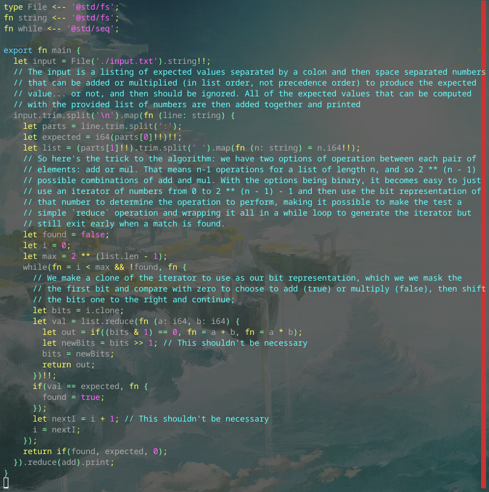

# Day 7 Part 1

## Implemented with [this Alan commit](https://github.com/alantech/alan/commit/1af94aae8c3eb0e5d58226cc9bb5d8400fcb49bb)

## Required PRs

1. [Only convert the outer closures into block syntax for the three block hacks](https://github.com/alantech/alan/pull/1004) - I needed a true "functional style" if call that returns a value to save into a variable within the while loop, and this was accidentally breaking it.

## Build and run commands

* Native: `alan test source.ln`
* Javascript: `alan test --js source.ln`

## Thoughts

This one was simpler than I originally thought. I figured I needed a proper iterator, so I [went ahead and built one](https://github.com/alantech/alan/pull/1003), which necessitated some significant changes to allow functions to declare their own function arguments as mutable (so the iterator could work *without* the hack and without a new block syntax, though I am still considering a `Block` type to codify that hack and not allow function references as an argument, only explicit closures).

It turned out to be much closer to the first couple of days of problems, and the only change to the language actually needed was just patching a corner case of the hack.
