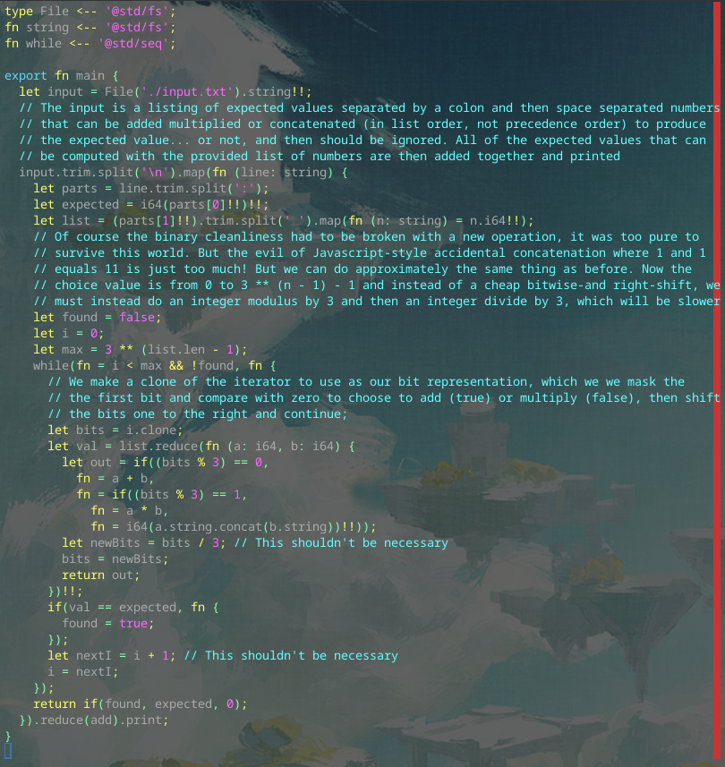

# Day 7 Part 2

## Implemented with [this Alan commit](https://github.com/alantech/alan/commit/1af94aae8c3eb0e5d58226cc9bb5d8400fcb49bb)

## Required PRs

No extra PRs required beyond Day 7 Part 1.

## Build and run commands

* Native: `alan test source.ln`
* Javascript: `alan test --js source.ln`

## Thoughts

At first I was worried about the move from a binary encoding to trinary encoding for the operation selection, but it didn't really alter the loop much at all in the end. There is something seriously wrong with either the modulus or integer division code I wrote for Javascript (or these operations are just that slow in BigInt?) because that wasn't just ~2x as slow of a running time, but more like ~10x, though I didn't explicitly time it.
